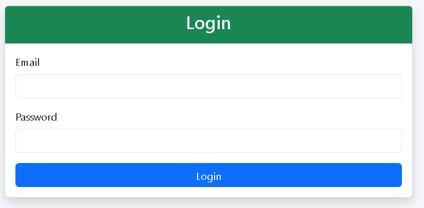
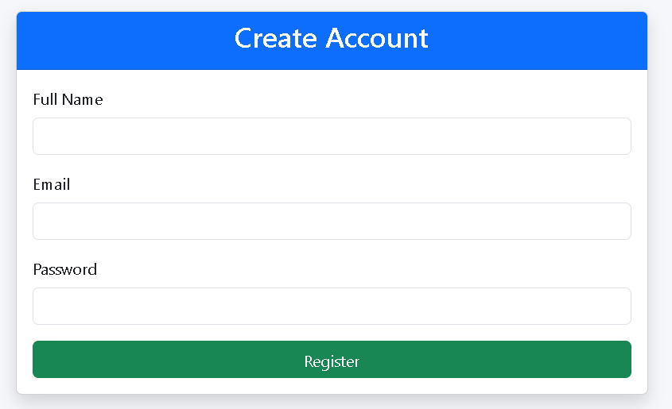
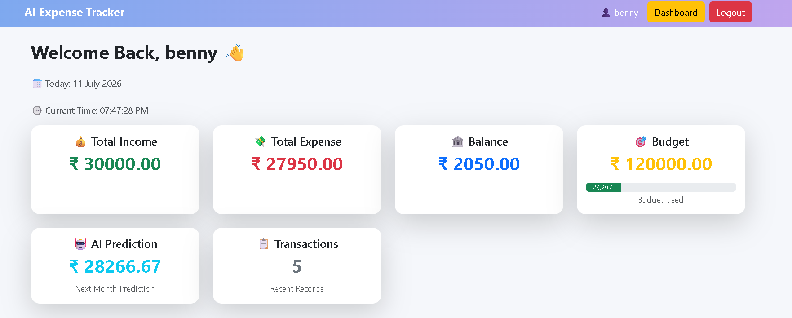
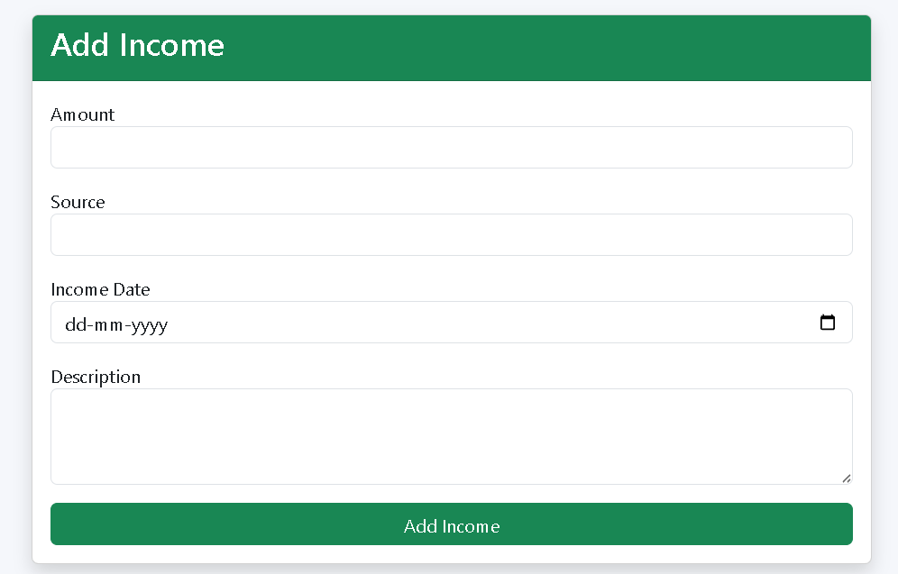
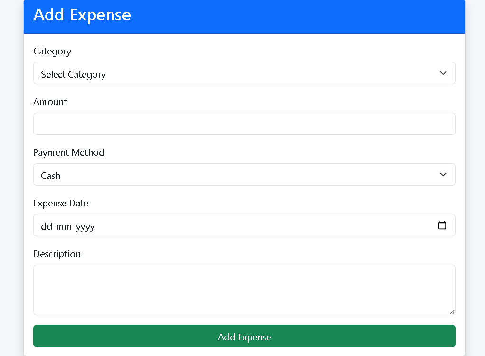
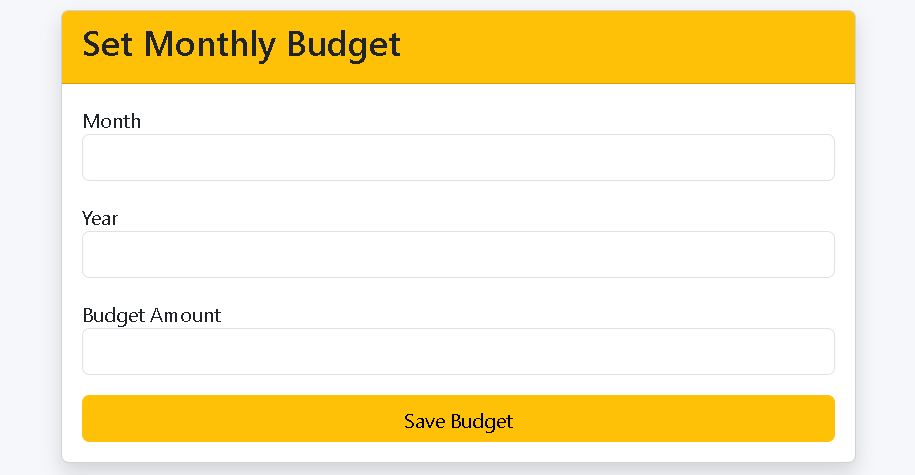
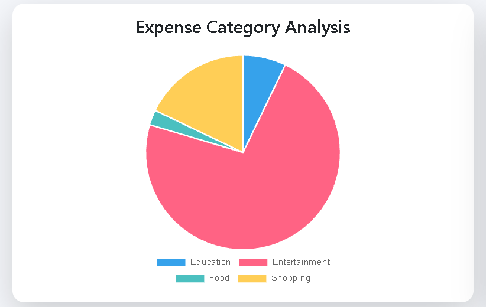
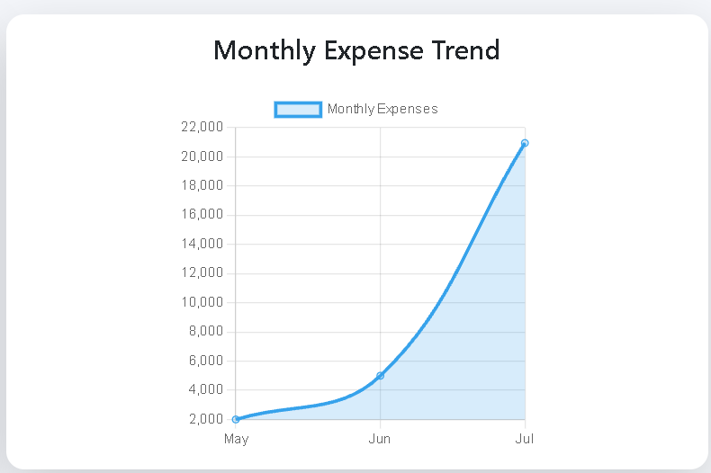
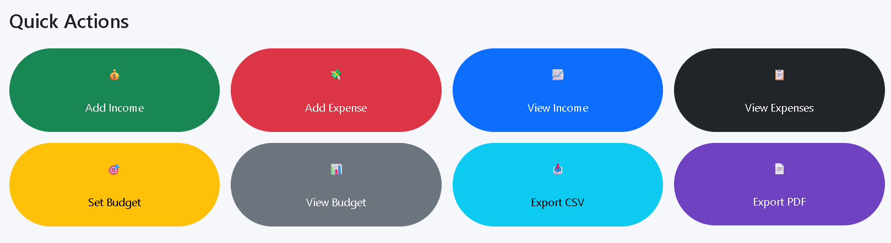

# 💰 AI Powered Smart Expense Tracker

A full-stack web application that helps users manage their income, expenses, budgets, and financial insights using Artificial Intelligence.

This project is developed using **Flask, PostgreSQL, Python, Machine Learning, HTML, CSS, JavaScript, and Bootstrap**.

---

# 📌 Features

## 👤 User Module
- User Registration
- Secure Login & Logout
- Password Hashing

## 💰 Income Management
- Add Income
- View Income
- Edit Income
- Delete Income

## 💸 Expense Management
- Add Expense
- View Expenses
- Edit Expenses
- Delete Expenses

## 🎯 Budget Management
- Set Monthly Budget
- View Budget
- Budget Usage Progress Bar
- Budget Status Indicator

## 📊 Dashboard
- Total Income
- Total Expenses
- Current Balance
- Budget Overview
- Recent Transactions
- Total Transactions

## 📈 Charts
- Expense Category Pie Chart
- Monthly Expense Trend Line Chart

## 🤖 AI Features
- AI Expense Prediction
- Smart Spending Insights
- Highest Spending Category Detection
- Budget Status Analysis
- Expense Anomaly Detection

## 📄 Reports
- Export Expenses to CSV
- Export Expenses to PDF

## 🎨 User Interface
- Responsive Dashboard
- Bootstrap Cards
- Live Digital Clock
- Professional Design

---

# 🛠 Technologies Used

### Frontend
- HTML5
- CSS3
- Bootstrap 5
- JavaScript
- Chart.js

### Backend
- Python
- Flask

### Database
- PostgreSQL
- psycopg2

### Machine Learning
- Scikit-learn
- NumPy
- Pandas

### Report Generation
- ReportLab

---

# 📂 Project Structure

```
AI_Expense_Tracker/
│
├── app.py
├── requirements.txt
├── README.md
├── .gitignore
│
├── database/
├── ml/
├── models/
├── static/
├── templates/
├── utils/
```

---

# 🚀 Installation

### Clone the Repository

```bash
git clone <repository-link>
```

### Move to Project Folder

```bash
cd AI_Expense_Tracker
```

### Create Virtual Environment

```bash
python -m venv venv
```

### Activate Virtual Environment

Windows

```bash
venv\Scripts\activate
```

Linux / Mac

```bash
source venv/bin/activate
```

### Install Dependencies

```bash
pip install -r requirements.txt
```

### Configure PostgreSQL Database

Create the required database and tables.

### Run Application

```bash
python app.py
```
# 📷 Screenshots

## Login Page



---

## Register Page



---

## Dashboard



---

## Income Management



---

## Expense Management



---

## Budget Management



---

## Expense Category Analysis



---

## Monthly Expense Trend



---


## Monthly Expense Trend


---

# 🤖 AI Modules

- Expense Prediction
- Smart Spending Insight
- Budget Analysis
- Anomaly Detection

---

# 🔮 Future Enhancements

- Email Notifications
- Mobile Application
- OCR Bill Scanner
- AI Chatbot
- Voice Expense Entry
- Cloud Deployment
- Multi-Currency Support

---

# 👩‍💻 Developer

**Deepthi Reddy**

B.Tech Computer Science Engineering

Aspiring Data Analyst | Full Stack Developer

---

# 📜 License

This project is developed for educational and learning purposes.